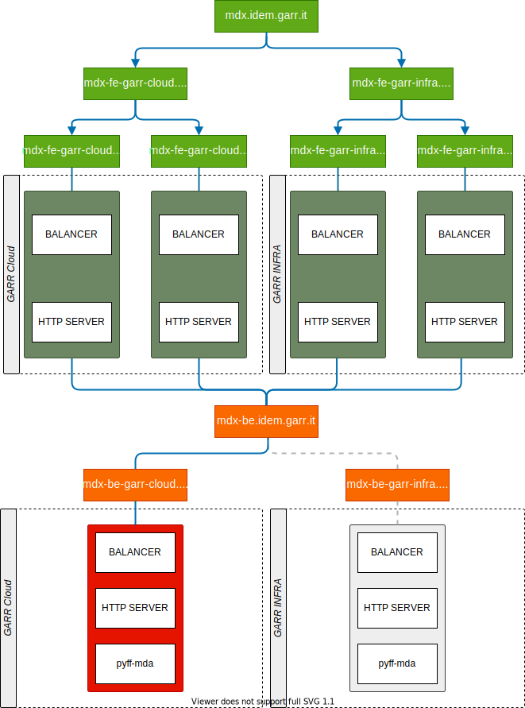

########
IDEM MDX 
########

Introduction
==============

This repository hosts the IDEM MDX project. It's an implementation of
the Metadata Query Protocol for SAML, that enables retrieving metadata about
named entities, or named collections of entities. The protocol works on top of
HTTP.

In the context of the identity federations, and particularly for IDEM, MDQ is
very attractive for both Identity Providers and Service Providers as it will let
them avoid downloading big sized metadata aggregates that are quite CPU
intensive to parse. For example the current size of the metadata aggregate that
contains both the IDEM entities and eduGAIN ones is more than 75 Megabytes in
size and it has more than 8500 entities.  

The components developed in this repository are:

* the service back end, that will be used to parse the official IDEM metadata 
  aggregates and it will create and sign one metadata file per entity. 

* the service front end, that will be able to serve the metadata files created by 
  the service back end to the requesters.

Rerefences
============

The Metadata Query Protcol specification is broken into two parts: the base
protocol and a SAML profile. Both specifitions are currently IETF drafts:

* Base protocol: https://datatracker.ietf.org/doc/draft-young-md-query/
* SAML profile: http://datatracker.ietf.org/doc/draft-young-md-query-saml/

Proposed Architecture
========================

Development Instructions
=========================

Development instructions are available inside the docs/ folder in this repository.

Contacts
========

* Davide Vaghetti (davide.vaghetti@garr.it)
* Mario Di Lorenzo (mario.dilorenzo@garr.it)

